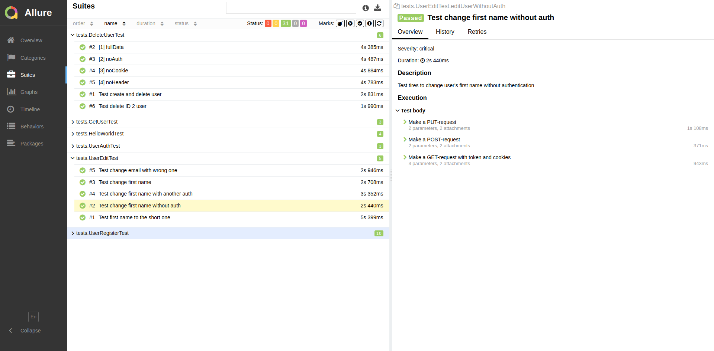

# REST API test automation with Java course
## About
This repository presents my resulting project for REST API test automation with Java course by https://software-testing.ru/.
It runs tests for training sandbox located at https://playground.learnqa.ru/api/. Tests are run by Docker and resulting test report is provided by Allure.

Methods map: https://playground.learnqa.ru/api/map

Stack used for this course:

* Java
* Maven
* JUnit 5
* Allure
* Docker

## How to run
_Pre-requisites_
* Install [Git](https://git-scm.com/book/en/v2/Getting-Started-Installing-Git)
* Install [Docker](https://docs.docker.com/engine/install/)
* Install [Allure](https://docs.qameta.io/allure-report#_installing_a_commandline) 

Clone repository from GitHub to your local folder:

```
mkdir ~/JavaApiCourse
cd ~/JavaApiCourse
git clone https://github.com/igor8terekhin/JavaApi_Course.git
```

To run tests in Docker:

```
docker-compose up --build
```

To see tests results in Allure report

```
allure serve
```

The resulting report should look something like this:

